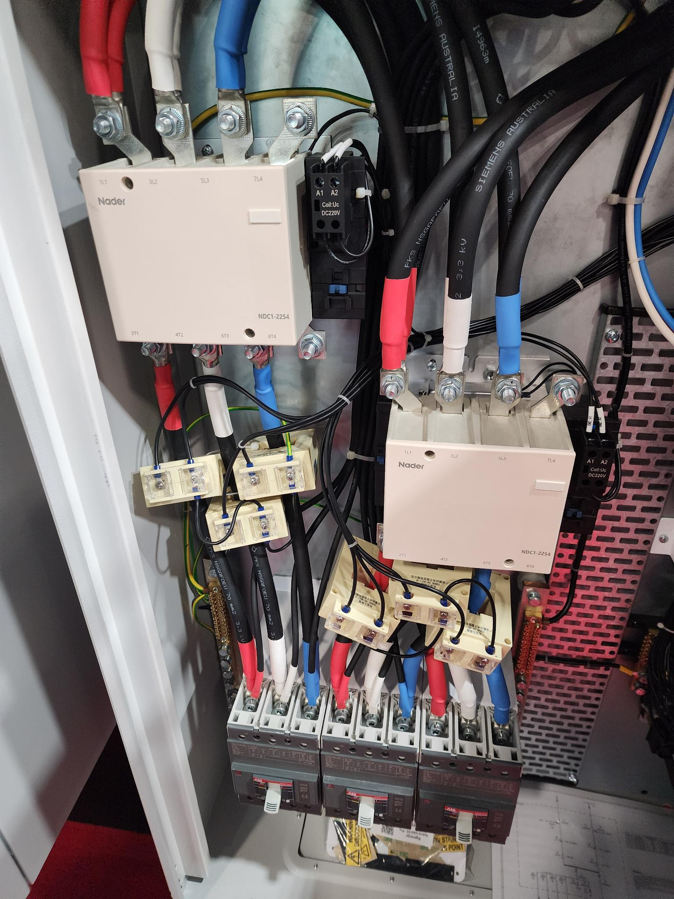

# A Data-Driven Energy Resource Management System for Utilizing CBS Backup Power Toward Smart City Resilience

## 🧭 Project Vision

This system takes a proactive approach to utilizing and redesigning the backup power systems of **Cellular Base Stations (CBSs)**—transforming them into **distributed, intelligent energy hubs** that support **power resilience** in smart cities. The architecture integrates real-time sensing, cloud intelligence, and AI-driven decision-making to optimize energy usage, detect anomalies, and dispatch backup power intelligently across critical infrastructures.

---

## ⚙️ Core Modules and Components

### ⚡ 1. Intelligent Sensor & Control (`ISC`)

*📸 Figure: An example of `ISC` hardware inside the CBS power cabinet with real-time monitoring modules.*

The `ISC` unit acts as the intelligent edge layer responsible for local energy control in cellular base stations. It performs the following key roles:

- 🧠 **Monitoring** — Read real-time power related data such as `voltage`, `current`, and `power consumption`.  
- 🔄 **Optimization** — Applies on-device logic for local energy efficiency and load balancing.  
- 🌐 **Communication** — Sends and receives data and control signals via `MQTT` or `Modbus` protocols to/from the cloud.

### 2. Secure Broker Layer
- Built on **Mosquitto** with **TLS encryption**.
- Handles publish-subscribe messaging between ISCs and the cloud.

### 3. Cloud Operations
- Processes incoming data streams.
- Implements clustering, pre-processing, and decision analytics.
- Built using **Node.js**, **Express**, and **PostgreSQL**.

### 4. Machine Learning Ops
- **Anomaly Detection**: Regression-based models for early warning.
- **Predictive Analysis**: Multi-layer stacked deep learning models for load forecasting.
- **Optimization**: AI-based decision-making using **Deep Reinforcement Learning (DRL)** or **LLMs** to schedule and dispatch backup power.

### 5. Control Signal Dispatch
- Cloud sends intelligent control signals to edge ISC units.
- Uses **MQTT** or **Modbus** for signal communication.

### 6. Frontend Dashboard
- Developed using **React**.
- Admin panel includes:
  - Real-time monitoring of CBS energy data.
  - Visualization of detected anomalies.
  - Predictive alerts and control logs.

### 7. RESTful API Layer
- Backend exposes endpoints for:
  - Data upload from ISCs
  - Control commands
  - Visualization queries for the dashboard

---

## 📦 Tech Stack Overview

| Layer         | Tools/Technologies                     |
|--------------|-----------------------------------------|
| Edge Devices | Microcontrollers, PLC, Energy Sensors   |
| Protocols    | MQTT, Modbus, TLS                       |
| Broker       | Mosquitto                            |
| Cloud Backend| Node.js, Express, PostgreSQL         |
| ML Stack     | TensorFlow, PyTorch, Scikit-learn    |
| Frontend     | React.js                             |
| APIs         | RESTful (JSON over HTTP)             |

---

## 🚀 Roadmap

🔲 Enable Virtual Power Plant (VPP) coordination among CBSs
🔲 Add battery health and renewable energy generation monitoring
🔲 Support emergency dispatch to nearby Critical Infrastructures (CIs)
🔲 Add mobile app interface (React Native or Flutter)

---

## 👨‍🔬 Developers

**Raihan Bin Mofidul**  
AIoT & Smart Energy Systems Researcher  
Sydney, Australia

> Under Supervision of 
**Prof. Dr. Jahangir Hossain**

---

## 📬 Contact

For technical collaboration or inquiries, please visit:  
🔗 [https://profiles.uts.edu.au/Raihan.BinMofidul](https://profiles.uts.edu.au/Raihan.BinMofidul)

---

## 📄 License

This project is licensed. See the `LICENSE` file for details.

